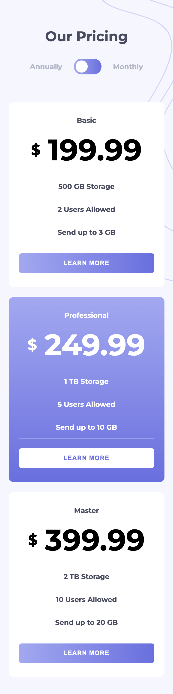

# Frontend Mentor - Pricing component with toggle solution

This is a solution to the [Pricing component with toggle challenge on Frontend Mentor](https://www.frontendmentor.io/challenges/pricing-component-with-toggle-8vPwRMIC). Frontend Mentor challenges help you improve your coding skills by building realistic projects.

## Table of contents

- [Overview](#overview)
  - [The challenge](#the-challenge)
  - [Screenshot](#screenshot)
  - [Links](#links)
- [Author](#author)
- [Acknowledgments](#acknowledgments)

## Overview

### The challenge

Users should be able to:

- View the optimal layout for the component depending on their device's screen size
- Control the toggle with both their mouse/trackpad and their keyboard
- **Bonus**: Complete the challenge with just HTML and CSS

### Screenshot

.png)

### Links

- Solution URL: [Solution URL here](https://github.com/ahmedsaliuGit/pricing-component-with-toggle)
- Live Site URL: [Live site URL here](https://ahmedsaliugit.github.io/pricing-component-with-toggle/)

## Author

- Website - [Ahmed Saliu](https://www.frontendmentor.io/profile/ahmedsaliuGit)
- Frontend Mentor - [@ahmedsaliuGit](https://www.frontendmentor.io/profile/ahmedsaliuGit)

## Acknowledgments

My deepest gratitude goes to Frontend Mentor
